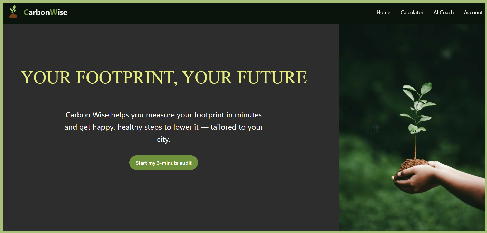
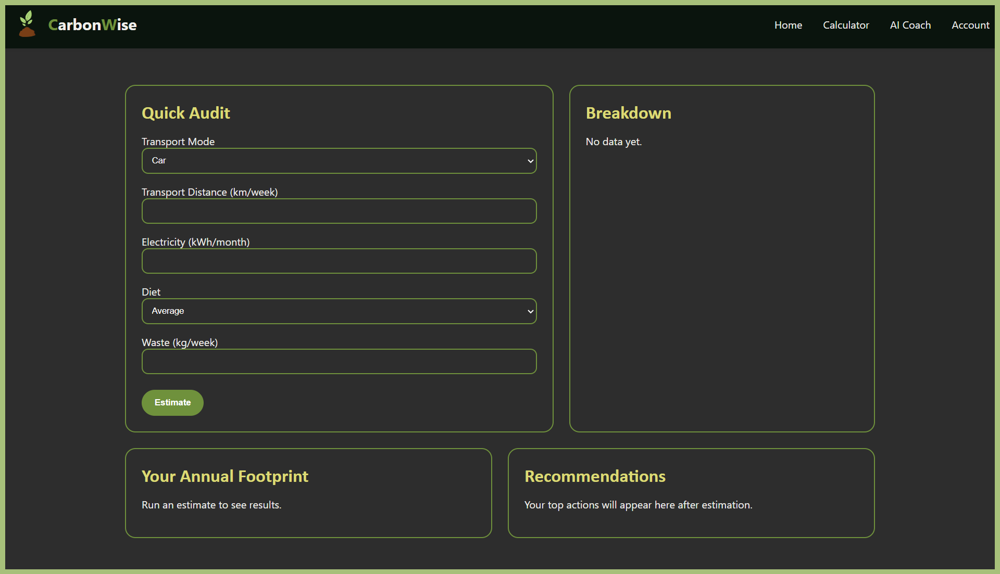
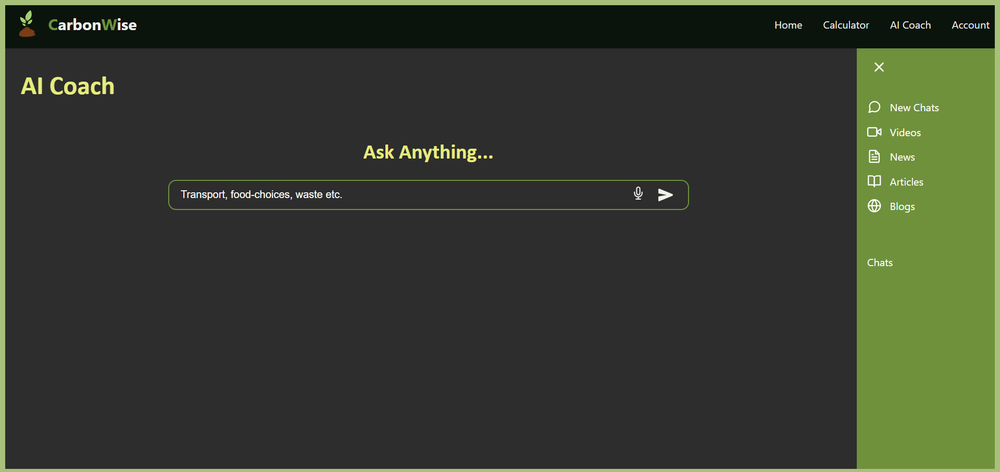
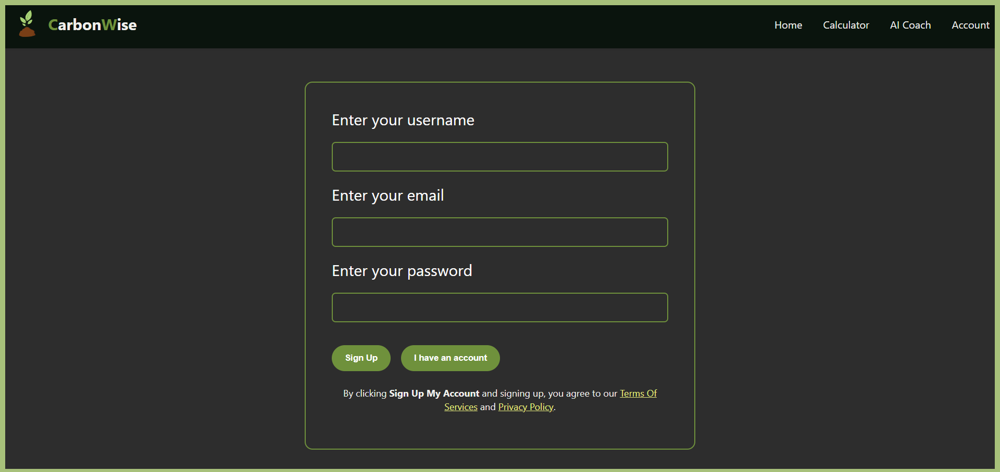
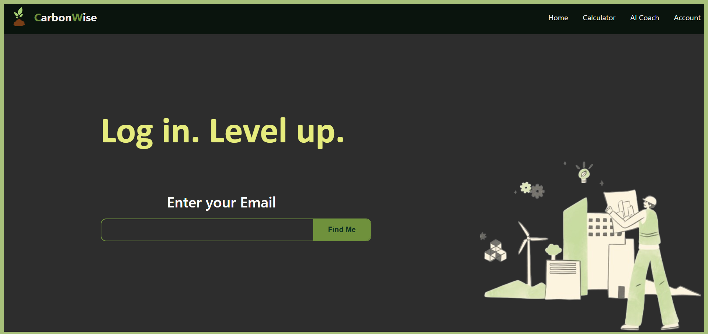

  <h1 align="center">🌱 CarbonWise</h1>
  

    A carbon footprint tracking & coaching app to help you measure, understand, 
    and <b style="color:#dcda75;">reduce your environmental impact</b>.
  

<h2>🔧Tech Stack</h3>

  
  
    
  
  
  

<h2>✨ Features</h2>

<ul>
<li><b>🚗 Tracking</b></li>
  
Track lifestyle inputs: <b>transport, energy, diet, waste</b>

  <li>📊 <b>Visualization</b></li>
  
Detailed footprint breakdown with <b>charts & visuals</b>

  <li>💡 <b>Tips</b></li>
  
Personalized recommendations to cut emissions

  <li>🤖 <b>AI</b></li>
  
Rule-based AI powered coaching system

  <li>🔒 <b>Authentication</b></li>
  
Secure login with <b>JWT + bcrypt</b></li>
  <li>🌐 <b>Access</b></li>
  
Works online & offline with fallbacks

</ul>

<h2>🌿 Carbon Footprint Engine</h2>

<table>
  <tr style="background: #a7c07a;">
    <th style="padding: 10px; border: 1px solid #ccc; text-align:center;">Category</th>
    <th style="padding: 10px; border: 1px solid #ccc; text-align:center;">Calculation Method</th>
  </tr>
  <tr>
    <td style="padding: 10px; border: 1px solid #ccc;">🚗 Transport</td>
    <td style="padding: 10px; border: 1px solid #ccc;">Mode factors → Car: <code>0.192</code> · Bus: <code>0.082</code> · Metro: <code>0.028</code> (kg/km)</td>
  </tr>
  <tr>
    <td style="padding: 10px; border: 1px solid #ccc;">⚡ Energy</td>
    <td style="padding: 10px; border: 1px solid #ccc;">Grid electricity → <code>0.70</code> kg/kWh</td>
  </tr>
  <tr>
    <td style="padding: 10px; border: 1px solid #ccc;">🍔 Diet</td>
    <td style="padding: 10px; border: 1px solid #ccc;">Multipliers → Meat-heavy: <code>1.3x</code> · Vegetarian: <code>0.75x</code> · Vegan: </code>0.6x<code></td>
  </tr>
  <tr>
    <td style="padding: 10px; border: 1px solid #ccc;">🗑️ Waste</td>
    <td style="padding: 10px; border: 1px solid #ccc;">Category-specific emission factors</td>
  </tr>
</table>

> 👉 <b>Outputs: Annual totals · % distribution · category breakdown</b>

<h2>🏗️ System Architecture</h2>

<table>
  <tr style="background: #a7c07a; ">
    <th style="padding: 10px; border: 1px solid #ccc; text-align:center;">Component</th>
    <th style="padding: 10px; border: 1px solid #ccc; text-align:center;">Technology</th>
    <th style="padding: 10px; border: 1px solid #ccc; text-align:center;">Purpose</th>
  </tr>
  <tr>
    <td style="padding: 10px; border: 1px solid #ccc;">Frontend</td>
    <td style="padding: 10px; border: 1px solid #ccc;"> React 18 ⚛️ · TypeScript · Vite 🚀·  TailwindCSS 🎨 ·  Chart.js 📊</td>
    <td style="padding: 10px; border: 1px solid #ccc;">User interface & visualization</td>
  </tr>
  <tr>
    <td style="padding: 10px; border: 1px solid #ccc;">Backend</td>
    <td style="padding: 10px; border: 1px solid #ccc;">FastAPI ⚡ · Uvicorn 🔥 · Pydantic</td>
    <td style="padding: 10px; border: 1px solid #ccc;">API & business logic</td>
  </tr>
  <tr>
    <td style="padding: 10px; border: 1px solid #ccc;">Data</td>
    <td style="padding: 10px; border: 1px solid #ccc;">CSV (emission_factors.csv) + In-memory storage</td>
    <td style="padding: 10px; border: 1px solid #ccc;">Emission factors & user/auth</td>
  </tr>
  <tr>
    <td style="padding: 10px; border: 1px solid #ccc;">Auth</td>
    <td style="padding: 10px; border: 1px solid #ccc;">JWT 🔑 (python-jose) · bcrypt 🔒 (passlib)</td>
    <td style="padding: 10px; border: 1px solid #ccc;">Secure login & signup</td>
  </tr>
</table>

<h2>⚡ Backend Routes</h2>

<table>

  <tr style="background: #a7c07a;">
    <th style="padding: 10px; border: 1px solid #ccc;">Route</th>
    <th style="padding: 10px; border: 1px solid #ccc;">Purpose</th>
  </tr>
  <tr><td style="padding: 10px; border: 1px solid #ccc;">/estimate</td><td style="padding: 10px; border: 1px solid #ccc;">Calculate carbon footprint</td></tr>
  <tr><td style="padding: 10px; border: 1px solid #ccc;">/recommend</td><td style="padding: 10px; border: 1px solid #ccc;">Get reduction suggestions</td></tr>
  <tr><td style="padding: 10px; border: 1px solid #ccc;">/coach</td><td style="padding: 10px; border: 1px solid #ccc;">AI-based coaching</td></tr>
  <tr><td style="padding: 10px; border: 1px solid #ccc;">/auth</td><td style="padding: 10px; border: 1px solid #ccc;">Signup & login</td></tr>
  <tr><td style="padding: 10px; border: 1px solid #ccc;">/factors</td><td style="padding: 10px; border: 1px solid #ccc;">Get emission factors</td></tr>
</table>

<h2>📸 App Preview</h2>

  <h3>🏠 Home Page</h3>
  

  <h3>🧮 Carbon Calculator</h3>
  

  <h3>🤖 AI Coach</h3>
  

  <h3>🔑 Sign Up</h3>
  

  <h3>🔐 Log In</h3>
  

<h2>Getting Started</h2>

<h3>📥 Clone & Install</h3>

<pre>
git clone https://github.com/roseewood/CarbonWise.git
cd CarbonWise
</pre>

<b>⚙️ Backend setup</b>

<pre>
cd backend
python3 -m venv venv
source venv/bin/activate   # On Windows: venv\Scripts\activate
pip install -r requirements.txt
</pre>

<b>🎨 Frontend setup</b>

<pre>
cd ../frontend
npm install
</pre>

<h3>▶️ Run in Development</h3>

<b>🖥️ Backend</b>

<pre>
cd backend
uvicorn app:app --reload
</pre>

<b>🌐 Frontend (in a new terminal)</b>

<pre>
cd frontend
npm run dev
</pre>

Both servers should now be live ✨

<ul>
  <li>🔗 API → <code>http://127.0.0.1:8000</code></li>
  <li>💻 React app → <code>http://localhost:5173</code></li>
</ul>

<h2>❓ Why CarbonWise</h2>

  Because <b>sustainability should be simple</b>. 
  No jargon. No guilt. Just clear insights, easy actions, and real impact.

<h3>💡 Recommendation System</h3>

<ul>
  <li>📊 <b>Algorithm:</b> Rule-based (targets highest category)</li>
  <li>🎯 <b>Personalized:</b> Suggestions tailored to footprint breakdown</li>
  <li>🌍 <b>Impact:</b> Estimated CO₂ savings per action</li>
  <li><b>Categories:</b>
    <ul>
      <li>🚗 Transport switching</li>
      <li>⚡ Energy efficiency</li>
      <li>🍴 Dietary changes</li>
      <li>♻️ Waste reduction</li>
    </ul>
  </li>
</ul>

  MIT License © 2025 · Built with 💚 for a greener future

